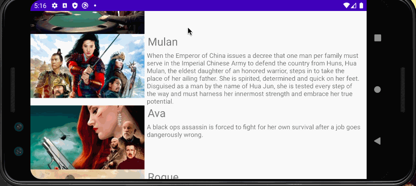

## Flix Part 2

### User Stories

#### REQUIRED (10pts)

- [X] (8pts) Expose details of movie (ratings using RatingBar, popularity, and synopsis) in a separate activity.
- [X] (2pts) Allow video posts to be played in full-screen using the YouTubePlayerView.

#### BONUS

- [ ] Trailers for popular movies are played automatically when the movie is selected (1 point).
  - [ ] When clicking on a popular movie (i.e. a movie voted for more than 5 stars) the video should be played immediately.
  - [ ] Less popular videos rely on the detailed page should show an image preview that can initiate playing a YouTube video.
- [ ] Add a play icon overlay to popular movies to indicate that the movie can be played (1 point).
- [ ] Apply the popular ButterKnife annotation library to reduce view boilerplate. (1 point)
- [ ] Add a rounded corners for the images using the Glide transformations. (1 point)

### App Walkthough GIF

 

### Notes

Some challenges that I had was understanding how Parcels worked after watching the guide videos. I had to actually go back and read the notes Codepath has on the subject.

## Open-source libraries used
- [Android Async HTTP](https://github.com/codepath/CPAsyncHttpClient) - Simple asynchronous HTTP requests with JSON parsing
- [Glide](https://github.com/bumptech/glide) - Image loading and caching library for Android

# Flix
Flix is an app that allows users to browse movies from the [The Movie Database API](http://docs.themoviedb.apiary.io/#).
---

## Flix Part 1

### User Stories
#### REQUIRED (10pts)
- [X] (10pts) User can view a list of movies (title, poster image, and overview) currently playing in theaters from the Movie Database API.

#### BONUS
- [X] (2pts) Views should be responsive for both landscape/portrait mode.
   - [X] (1pt) In portrait mode, the poster image, title, and movie overview is shown.
   - [X] (1pt) In landscape mode, the rotated alternate layout should use the backdrop image instead and show the title and movie overview to the right of it.

- [ ] (2pts) Display a nice default [placeholder graphic](https://guides.codepath.org/android/Displaying-Images-with-the-Glide-Library#advanced-usage) for each image during loading
- [ ] (2pts) Improved the user interface by experimenting with styling and coloring.
- [ ] (2pts) For popular movies (i.e. a movie voted for more than 5 stars), the full backdrop image is displayed. Otherwise, a poster image, the movie title, and overview is listed. Use Heterogenous RecyclerViews and use different ViewHolder layout files for popular movies and less popular ones.

### App Walkthough GIF
Landscape: 

 

Portrait:

 

### Notes
Describe any challenges encountered while building the app.

I had some challenges that came with adding dependencies correctly at the beginning of the project. I was getting some errors associated with not having the correct dependencies, 
and the API used didn't match up with the XML of Main Activity.
I was also reading on documentation and found quite confusing when it came to understanding RecyclerView, Adapters, and how it all tied together. The resources provided by Codepath definitely helped!

### Open-source libraries used

- [Android Async HTTP](https://github.com/codepath/CPAsyncHttpClient) - Simple asynchronous HTTP requests with JSON parsing
- [Glide](https://github.com/bumptech/glide) - Image loading and caching library for Androids
